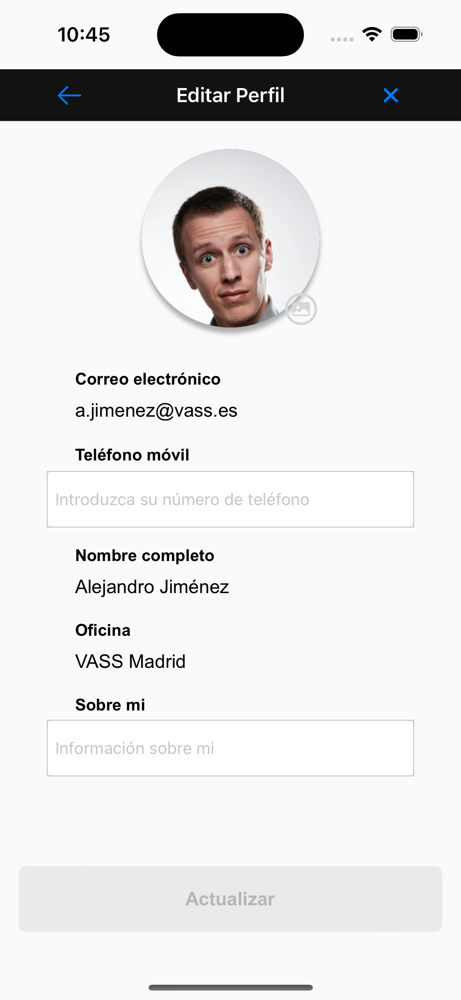
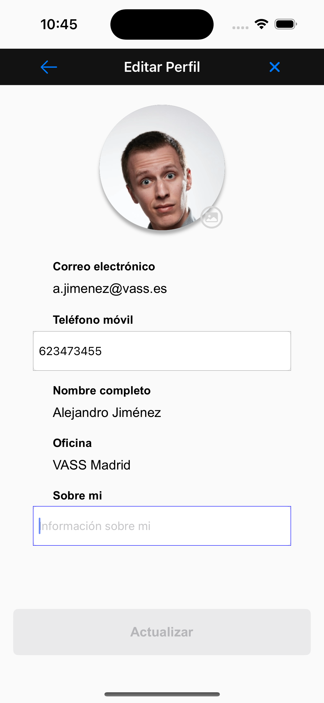
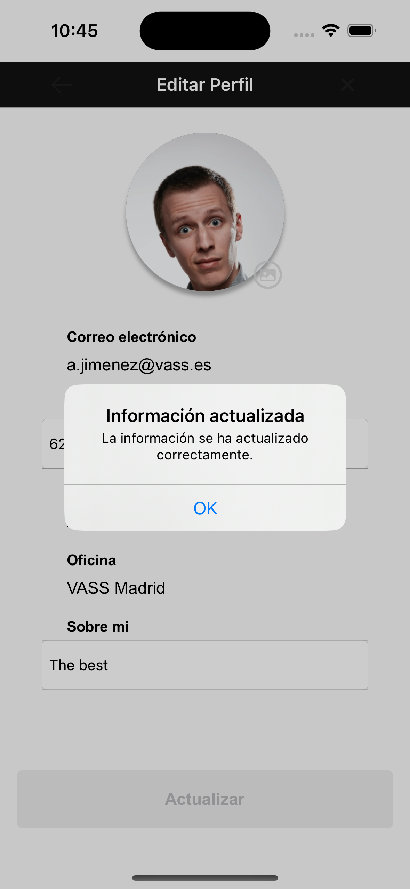
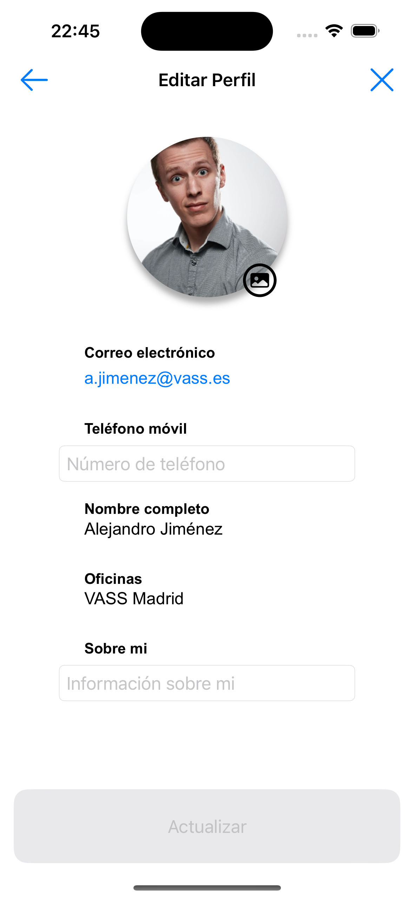

# PerfilEditApp

PerfilEditApp es una aplicación móvil que permite a los usuarios editar su perfil, incluyendo detalles como la imagen de perfil, el correo electrónico, el número de teléfono, el nombre completo, la oficina y una breve descripción sobre ellos mismos.

## Funcionalidades

- Visualización y edición de la imagen de perfil.
- Edición del correo electrónico.
- Edición del número de teléfono.
- Edición del nombre completo.
- Visualización y edición de la oficina.
- Edición de una breve descripción sobre el usuario.

## Capturas de pantalla

## Instalación

Para probar la aplicación en tu dispositivo iOS, sigue estos pasos:

1. Clona este repositorio en tu máquina local.
2. Abre el proyecto en Xcode.
3. Conecta tu dispositivo iOS y selecciona tu dispositivo como destino de implementación.
4. Pulsa el botón de ejecución en Xcode para compilar y ejecutar la aplicación en tu dispositivo.

## Contribución

Si quieres contribuir a este proyecto, sigue estos pasos:

1. Haz un fork del repositorio.
2. Crea una nueva rama (`git checkout -b feature/nueva-funcionalidad`).
3. Realiza tus cambios y haz commits (`git commit -am 'Agrega nueva funcionalidad'`).
4. Haz push a la rama (`git push origin feature/nueva-funcionalidad`).
5. Abre un Pull Request.

## Tecnologías utilizadas

- Swift
- UIKit
- SwiftUI

## Créditos

Desarrollado por [Daniel].

## Licencia

Este proyecto está licenciado bajo la Licencia MIT - consulta el archivo [LICENSE.md](LICENSE.md) para más detalles.
